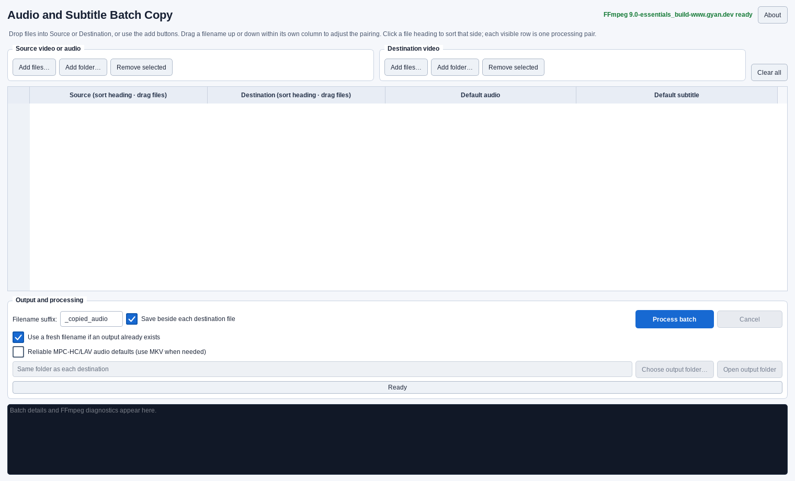

# Audio and Subtitle Batch Copy

Audio and Subtitle Batch Copy is a Windows desktop app for copying every audio
and/or subtitle track from source media into paired destination videos. Video is
never re-encoded: FFmpeg is always invoked with direct stream copy.



## Download

Download the current portable Windows package from the
[GitHub Releases page](https://github.com/skv89/Audio-Subtitle-Batch-Copy/releases/latest).

Version 1.2.4 Windows ZIP SHA-256:

`c8f0301da94685176cd15088c4b785f87183f21912f846f219c55a0a2c71357a`

## Quick start (portable Windows build)

1. Extract the entire release ZIP. Do not run the EXE from inside the ZIP.
2. Open **Audio and Subtitle Batch Copy.exe**.
3. Drag source video/audio files into the Source column and destination videos
   into the Destination column. You can also use **Add files** or **Add folder**.
4. Confirm each visible row is the intended source/destination pair. Drag a
   filename up or down within its own column to adjust a manual pairing.
5. Choose the default output audio and subtitle tracks. Every menu choice says
   **Source -** or **Destination -**. Destination tracks appear after the
   matching **Keep destination…** box is enabled. Choose **No default subtitle**
   if subtitles should not start automatically.
6. Adjust the four per-row checkboxes if needed, then click **Process batch**.

Leave **Reliable MPC-HC/LAV audio defaults** unchecked for normal use. This
preserves MP4/MOV and works with players such as VLC and Windows Media Player
that honor the file's default track. Check it only if you need the optional MKV
workaround for MPC-HC/LAV and affected tracks share one language tag.

**Use a fresh filename if an output already exists** separately keeps older
outputs instead of replacing them and can avoid pathname-based player history.

The table accepts up to 120 source files and 120 destination files. All four
columns use one vertical scrollbar.

## Sorting and pairing

Click Source or Destination to toggle natural name sorting on that side. The two
sides sort independently so alphabetically named batches can be aligned. A
source's copy settings and preferred source tracks stay with that source; a
destination's keep settings stay with that destination. A combined default
choice is remembered for its exact source/destination pair. After sorting, the
files visible in row N are the files that will be paired for row N.

You can also drag a Source or Destination filename vertically within its own
column. Manual movement changes only that side's order and retains all settings
attached to the moved file. Drops into the other side or into the track columns
are rejected.

## Per-row controls

- **Copy audio tracks** — copy all source audio tracks (default: on).
- **Copy subtitle tracks** — copy all source subtitle tracks (default: on).
- **Keep destination audio tracks** — retain destination audio while adding
  source audio (default: off).
- **Keep destination subtitle tracks** — retain destination subtitles while
  adding source subtitles (default: off).

The menus list every track that will exist in the output and prefix it with
**Source -** or **Destination -**. This keeps equal track names unambiguous. The
selected track becomes the sole default for that stream type. **No default
subtitle** clears the default flag from all output subtitle tracks. Existing
non-default disposition flags, such as forced subtitles, are retained when the
output container supports them. For broader player compatibility, a selected
default track is also placed first among output tracks of its type; all other
tracks retain their relative order.

When **Process batch** is clicked, the app reads each visibly displayed menu
choice again before planning FFmpeg. The batch log records the captured default
audio and subtitle choices for every row before processing starts.

## Output behavior and safety

- Default folder: beside each destination.
- Default suffix: `_copied_audio`.
- You may choose one alternate output folder, change the suffix, or leave it
  blank.
- **Open output folder** opens the chosen one-folder destination. In the default
  per-destination mode, select a row to open that destination's folder; with no
  selection, the first available destination folder is used.
- A blank suffix beside the destination means replacing that destination. The
  app warns first and offers **Apply this choice to all**.
- **Use a fresh filename if an output already exists** is on by default. For a
  non-destination collision, the prior output is kept and the new output gets a
  batch-unique `~fresh-…` identity. Turn this option off to use the existing
  Replace/Skip dialog instead. A blank-suffix destination overwrite is never
  silently renamed.
- **Reliable MPC-HC/LAV audio defaults** is off by default. LAV 0.80 can ignore
  MP4/MOV audio default flags when several tracks share one language tag and
  then choose a different track using its quality preference. Check this option
  to plan affected rows directly as MKV, where the selected default flag is
  recognized. The batch log states exactly when this compatibility path is used.
- Every output is written to a unique temporary file, independently probed, and
  only then atomically installed. An existing output is not destroyed by a
  failed FFmpeg operation.
- MP4/MOV-family outputs receive an additional box-level check: the selected
  audio track must be the only audio `tkhd` track marked Enabled. The batch log
  records the verified output ordinals and this track-header result.
- Except for the explicit MPC-HC/LAV compatibility case above, the destination
  container is tried first. If it cannot mux the selected codecs without
  conversion, the app removes the failed partial attempt and retries once as
  Matroska (`.mkv`). It never transcodes as a fallback.
- A locked destination cannot be replaced. If direct copy and verification
  finish but Windows refuses the final replacement, the log gives the exact
  completed recovery-file path.

## FFmpeg and logs

The portable release ships with and requires the FFmpeg 9.x tool pair. Version
1.2.4 is release-tested against FFmpeg **9.0** specifically. The app refuses to
silently use an older PATH installation.

The Git repository intentionally does not store the large FFmpeg executables.
For source use, either put FFmpeg 9.x `ffmpeg.exe` and `ffprobe.exe` under
`tools\ffmpeg\bin`, or make the matching pair available on `PATH`. The portable
release already includes the audited FFmpeg 9.0 pair and its license materials.

Persistent batch logs are written under:

`%LOCALAPPDATA%\AudioSubtitleBatchCopy\Audio and Subtitle Batch Copy\logs`

## Limitations

- Direct stream copy cannot make every codec combination valid in every
  container. MKV is the broadest practical fallback, but an unusual codec or
  malformed stream can still fail; the exact FFmpeg diagnostic is retained.
  If an affected compatibility row contains a codec that MKV cannot accept by
  direct copy, the app fails safely rather than re-encoding or silently making
  an MP4 with a default known to be unreliable in MPC-HC/LAV.
- The portable EXE is not code-signed, so Windows SmartScreen may show an
  unrecognized-publisher warning on another computer.
- Folder addition reads supported media files in the selected folder only; it
  does not recurse into subfolders.

## Development

The source project uses Python 3.13, PySide6 6.11.1, pytest, Ruff, mypy, and
PyInstaller. From this directory:

```powershell
py -3.13 -m venv .venv
.\.venv\Scripts\python.exe -m pip install -r requirements-dev.txt
.\.venv\Scripts\python.exe -m pytest
.\.venv\Scripts\python.exe -m ruff check src tests scripts
.\.venv\Scripts\python.exe -m mypy src
```

The complete local test suite expects FFmpeg 9.0. If that tool pair is not yet
available, run the non-integration tests with:

```powershell
.\.venv\Scripts\python.exe -m pytest -m "not integration"
```

To make a portable Windows build:

1. Place `ffmpeg.exe` and `ffprobe.exe` under `tools\ffmpeg\bin`.
2. Create the icon once with `scripts\create_icon.py` if the checked-in icon
   assets need to be regenerated.
3. Run `scripts\build_release.ps1`.

The build script locates Python and PyInstaller license files from the active
virtual environment; it contains no machine-specific paths.

## License

The application source is released under the MIT License. FFmpeg, Qt/PySide,
PyInstaller, Python, and Liberation Fonts remain under their respective
licenses. See `THIRD_PARTY_NOTICES.txt` and the included license files.
